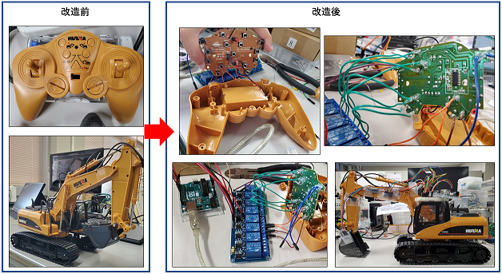
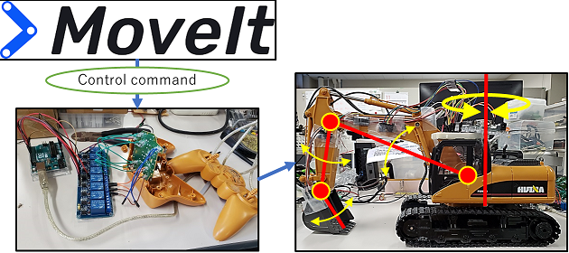

# rc_backhoe_ros

購入した[ラジコンカー こども向け パワーショベル 重機ラジコン RC建設おもちゃ](https://www.amazon.co.jp/%E3%83%A9%E3%82%B8%E3%82%B3%E3%83%B3%E3%82%AB%E3%83%BC-%E3%81%93%E3%81%A9%E3%82%82%E5%90%91%E3%81%91-%E3%83%91%E3%83%AF%E3%83%BC%E3%82%B7%E3%83%A7%E3%83%99%E3%83%AB-%E9%87%8D%E6%A9%9F%E3%83%A9%E3%82%B8%E3%82%B3%E3%83%B3-RC%E5%BB%BA%E8%A8%AD%E3%81%8A%E3%82%82%E3%81%A1%E3%82%83/dp/B0BFMMK76K/ref=sr_1_2_sspa?__mk_ja_JP=%E3%82%AB%E3%82%BF%E3%82%AB%E3%83%8A&crid=MVYOUBIGTL09&keywords=%E3%83%A9%E3%82%B8%E3%82%B3%E3%83%B3%E3%82%B7%E3%83%A7%E3%83%99%E3%83%AB&qid=1666681844&qu=eyJxc2MiOiI0LjI2IiwicXNhIjoiMi40MiIsInFzcCI6IjEuMDAifQ%3D%3D&sprefix=%E3%83%A9%E3%82%B8%E3%82%B3%E3%83%B3%E3%82%B7%E3%83%A7%E3%83%99%E3%83%AB%2Caps%2C228&sr=8-2-spons&psc=1&spLa=ZW5jcnlwdGVkUXVhbGlmaWVyPUEyNVdPMVlMTjU0OVoyJmVuY3J5cHRlZElkPUEwNzcwODM4QzNYRElNSDk0NlJUJmVuY3J5cHRlZEFkSWQ9QTNRS1dBU0gyVUlDVkomd2lkZ2V0TmFtZT1zcF9hdGYmYWN0aW9uPWNsaWNrUmVkaXJlY3QmZG9Ob3RMb2dDbGljaz10cnVl)
を改造してROSによるソフトウェア制御を行うプロジェクト．
ラジコンバックホウでの土砂積み込みを自動でできるようにすることを目指す．

## ハードウェアの準備

このプロジェクトでは一からロボットを作成するのではなく，既成品を改造することでPC制御をできる状態にする．

### 準備するもの

- [ラジコンバックホウ](https://www.amazon.co.jp/%E3%83%A9%E3%82%B8%E3%82%B3%E3%83%B3%E3%82%AB%E3%83%BC-%E3%81%93%E3%81%A9%E3%82%82%E5%90%91%E3%81%91-%E3%83%91%E3%83%AF%E3%83%BC%E3%82%B7%E3%83%A7%E3%83%99%E3%83%AB-%E9%87%8D%E6%A9%9F%E3%83%A9%E3%82%B8%E3%82%B3%E3%83%B3-RC%E5%BB%BA%E8%A8%AD%E3%81%8A%E3%82%82%E3%81%A1%E3%82%83/dp/B0BFMMK76K/)
- [Imu](https://www.amazon.co.jp/VKLSVAN-MPU-6050-3%E8%BB%B8%E3%82%B8%E3%83%A3%E3%82%A4%E3%83%AD%E3%82%B9%E3%82%B3%E3%83%BC%E3%83%97-%E5%8A%A0%E9%80%9F%E5%BA%A6%E3%82%BB%E3%83%B3%E3%82%B5%E3%83%BC%E3%83%A2%E3%82%B8%E3%83%A5%E3%83%BC%E3%83%AB-Arduino%E3%81%A8%E4%BA%92%E6%8F%9B/dp/B086GJTV58/)
- [リレー回路モジュール](https://www.amazon.co.jp/HAMILO-%E3%83%AA%E3%83%AC%E3%83%BC%E3%83%A2%E3%82%B8%E3%83%A5%E3%83%BC%E3%83%AB-Arduino%E7%94%A8-8%E3%83%81%E3%83%A3%E3%83%B3%E3%83%8D%E3%83%AB-%E9%9B%BB%E6%B0%97%E3%82%B9%E3%82%A4%E3%83%83%E3%83%81/dp/B07WSVVKGG/)
- Arduino（Imuとリレー回路モジュールが使えれば何でもよい）

### ハードウェアの作成

ラジコンバックホウには人間が操作するためのコントローラが付属している．
コントローラーの中身の基盤は下図のようになっている．
人間が操作するのはコントローラの電源スイッチとラジコンバックホウを操作するためのプッシュボタンのみである．
全ての操作をプッシュボタンのみで行っているので，電流のON/OFFのみで制御する仕様になっている．
プッシュボタンの接続部にリレー回路をはんだ付けしてマイコンでリレー回路を開閉することで制御する．
ここで使用しているマイコンはArduinoである．

## ソフトウェアの準備

ROSによりロボットアーム制御の要領でラジコンバックホウの自動掘削を行う．
ROSにはロボットアーム制御用パッケージのMoveitがあるので，ラジコンバックホウをロボットアームと見立てて自動掘削，自動積み下ろし制御を行う．
ROSの`hardware_interface`とMoveitの枠組みを使うことでArduinoの制御仕様に合わせたコマンドを生成し，Arduinoにシリアル通信で命令することで制御を行う．

## moveitによる制御の例

https://user-images.githubusercontent.com/42789340/216770462-079a6e56-3aed-4a73-9ddd-639258ed5709.mp4

## 注意点

使用したラジコンショベルのリモコンでの操作はプッシュボタンのON/OFFのみとなっており，角速度をユーザーが指定することができないので，そのためサンプル動画のような動きになる．
もし，滑らかに制御したい場合はラジコンショベル内部のモータを取り出して，モータードライバを使用するなどの対応が必要となる．
また，車両側面に取り付けたIMUの計測情報からブーム，アーム，バケット角度の推定をしているので，より精密な角度情報を得たければ関節部分にロータリーエンコーダーやポテンショメータなどを仕込む必要がある．

## 参考

- [pwri-opera/zx120_ros](https://github.com/pwri-opera/zx120_ros)